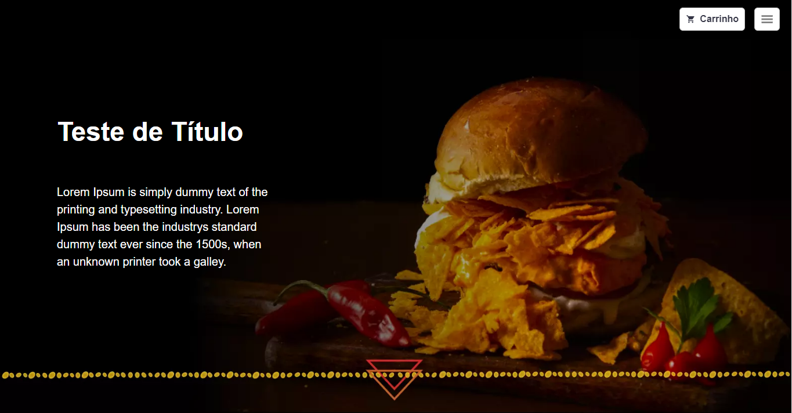

<h1 align="center">
   </> dash.go | Conteúdo Prático - Ignite ReactJS [Módulo 04]
</h1>

<br/>

## 💻 Projeto
 Dash.go é uma Single Page Application que demonstra uma estrutura básica de sistema, a aplicação tem um sistema de autenticação de usuário e também oferece um dashboard com vários tipos de relatório, demonstrados em gráficos e widgets. 

## 🔖 Layout

 <h1 align="center">
    
</h1>


 ## 🚀 Tecnologias

- [NextJS](https://nodejs.org/en/)
- [ReactJS](https://reactjs.org)
- [Typescript](https://www.typescriptlang.org/)

### 📡 Ferramentas Complementares
- [Chakra UI](https://chakra-ui.com/)
- [ApexCharts](https://apexcharts.com/)
- [Eslint](https://eslint.org/)

<br/>


## 🤔 Como posso interagir com projeto?

- Para instalar localmente, siga os passos abaixo:

<br/>

```sh
git clone https://github.com/ManuelMolina02/dash.go.git
```

Após baixar o projeto, acesse o repositório via terminal e execute os seguintes comandos:

```sh
yarn install
yarn dev
```

<br/>
<br/>

Feito com 💜 por Manuel Molina 👋 Me contate através do [LinkedIn!](https://www.linkedin.com/in/manuel-angel-berger-molina-ba08b3174/)